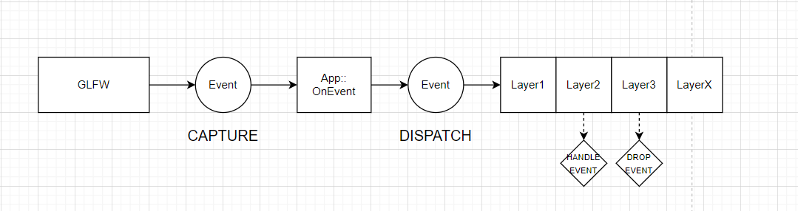
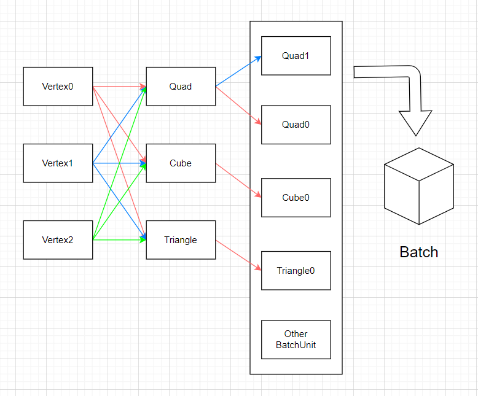

# Vortex Engine

a mini renderer used for studying and testing

## Support

windows10 x64


## Plan

- write perspective and orthographic camera √
- import libigl, load models √
- modify GUI，move viewport into ImguiWindow with frame buffer √
- finish batch render of opengl √
- create entity √
- import imguizmo 
- interaction in viewport √
  - get world pos of cursor in viewport window √
  - select point √
  - drag point √
- implement geo algorithms
- implement render algorithms


## Note

use shared_ptr or unique_ptr to manage heap space

achieve first, others second

design first, code second


## Third Party

[spdlog](https://github.com/gabime/spdlog.git)

[glfw](https://github.com/glfw/glfw.git)

[imgui](https://github.com/ocornut/imgui.git)

[glm](https://github.com/g-truc/glm.git)

[Home | Premake](https://premake.github.io/docs/)

[libigl](https://libigl.github.io/)

[Eigen](https://eigen.tuxfamily.org/index.php?title=Main_Page)

## Usage

```shell
git clone <repo> --recursive
.\GenerateProjects.bat
```


**delete submodule:**

```shell
cd Vortex/vendor/moduleA

git rm moduleA

vim .git/config, delete [submodule moduleA]...

rm .git/modules/Vortex/vendor/moduleA
```


**add submodule:**

```shell
git submodule add url
```


## Vortex

template:

H3 CLASS_NAME

---

> H4 ***BEHAVIOUR***

 H4 BEHAVIOUR1

description


H4 BEHAVIOUR2(STATIC)

description


> H4 ***MEMBER***

**MEMBER1**

description


**STATIC_MEMBER1(STATIC)**

description


### MAIN(VOID)

---

> #### *BEHAVIOUR*

#### Initialize log


#### create application


#### application loop


#### delete application


### Log

---

> #### *BEHAVIOUR*

#### Init

initialize loggers

settings:

- logger's name

- logger's level: output all

- output location: stdout or file


> #### *MEMBER*

**Core Logger(STATIC)**

used in vortex


**Client Logger(STATIC)**

used in sandbox


### Application

---

>  #### *BEHAVIOUR*

#### initialize app

- create window
- initialize backend render(not render component)
- push imgui layer


#### push layers

push layer to Layer part in Layer Stack (below Overlay part)

or push layer to Overlay part in Layer Stack (above Layer part)


#### OnEvent



CORE part to event handling
process:
 e -> captured by glfw 
 -> trigger window::eventCallBack(App::OnEvent)
-> Application::OnEvent(e) -> end


handle event:
e -> dispatch\<some event\>(handler) -> dispatch... -> ...
e -> layer1(OnEvent) -> layer2(OnEvent) -> ...


summary:

e1, e2, e3... -> APP -> win, camera, layer1, layer2...


problem:
Event processing (`glfwPollEvents`) stalls whenever the window is resized, 
see annotation of glfw3.h:glfwPollEvents()


main functions:

- handle all layers' events
- handle window events


#### **execute main loop**

run your code


> #### *MEMBER*

**Window**

glfw window


**ImGui Layer**

responsible for GUI rendering


**Last Frame Time**

(maybe should put in another place)


**States**

- running

  if application is running

- Minimized

  if window is minimized


### SandboxApp: Application

---

> #### *BEHAVIOUR*

#### add user's layer


#### create application


### Window

---

virtual base class

> #### *BEHAVIOUR*

#### set title, width, height


#### set sync

vsync


#### create main window

create glfw window


### WindowsWindow: Window

---

> #### *BEHAVIOUR*

#### init window's properties

- response to window resize

- response to window close

- response to key press, release, repeat

- response to unicode char input

- response to mouse press, release

- response to scroll

- response to mouse move

  

#### update window to flush graphics context


> #### *MEMBER*

**GLFW Window**


**Graphics Context**


**Window Data**

- width, height
- title
- event callback, which response to glfw events


dependency:

glfw


### GraphicsContext

---

context of renderer

> #### *BEHAVIOUR*

#### create graphics context


#### initialize context


#### swap buffers


### OpenGLContext: GraphicsContext

---

context of opengl

> #### *BEHAVIOUR*

#### initialize glfw context to OpenGLWindow


#### check opengl version


#### glfw swap buffers


### Event

---

the base of all kinds of events

> #### *MEMBER*

**Handled**

if this event has been handled


**event type**

> None = 0,
> WindowClose, WindowResize, WindowFocus, WindowLostFocus, WindowMoved,
> AppTick, AppUpdate, AppRender,
> KeyPressed, KeyReleased, KeyTyped,
> MouseButtonPressed, MouseButtonReleased, MouseMoved, MouseScrolled...

**event name**


**event categories**

> None = 0,
> EventCategoryApplication    = BIT(0),
> EventCategoryInput          = BIT(1),
> EventCategoryKeyboard       = BIT(2),
> EventCategoryMouse          = BIT(3),
> EventCategoryMouseButton    = BIT(4)


category:

application event:

- WindowResizeEvent
- WindowCloseEvent
- AppTickEvent
- AppUpdateEvent
- AppRenderEvent


input event:

key event:

- KeyEvent
- KeyPressedEvent
- KeyReleasedEvent
- KeyTypedEvent


mouse event:

- MouseMovedEvent
- MouseScrolledEvent
- MouseButtonEvent
- MouseButtonPressedEvent
- MouseButtonReleasedEvent


### EventDispatcher

---

> #### *BEHAVIOUR*

#### dispatch current event to some handle


#### BROADCAST event to different classes


### Input

---

get input response like key, mouse etc.

> #### *BEHAVIOUR*

#### get mouse position


#### check key pressed


#### check mouse button clicked


### WindowsInput: Input

---

package glfw input event


### Layer

---

> #### *BEHAVIOUR*

#### handle attach


#### handle detach


#### handle update


#### render gui


#### handle event


### ImGuiLayer: Layer

---

> #### *BEHAVIOUR*

#### initialize imgui context


#### config imgui


### LayerStack

---

store layers

LayerStack has two parts: Overlay on the top and Layer underneath it,
all of the layers in Overlay part are higher than layers in Layer part

> #### *BEHAVIOUR*

#### push/pop layer


#### push/pop overlay


### Timestep

---

calculate time


### BufferElement

---

the element of buffer

> #### *MEMBER*

**name**


**type of this element**


**size of this element**


**offset in buffer**

calculated in buffer layout


### BufferLayout

---

define the layout of buffer with the information of buffer elements, 

calculate every element's offset in one buffer unit and stride

> #### *MEMBER*

**buffer elements**


**stride**


### VertexBuffer

---

the buffer of vertices, which may include coordinates, colors, normals, etc.

> #### *BEHAVIOUR*

#### create vertex buffer

create and set buffer data


#### set data to buffer

if setted dynamic_draw, you can set data after create buffer


#### bind this vertex buffer to activate it


#### unbind this vertex buffer


#### get/set layout of vertices


#### OpenGLVertexBuffer: VertexBuffer

---


implementation  to vertexbuffer with opengl

> #### *MEMBER*

**id**


**layout**


### IndexBuffer

---

explain vertex coordinates as triangles

> #### *BEHAVIOUR*

#### create index buffer


#### set data to buffer

if setted dynamic_draw, you can set data after create buffer


#### bind this index buffer to activate it


#### unbind this index buffer


#### get count of indices


### OpenGLIndexBuffer: IndexBuffer

---

implementation  to indexbuffer with opengl

> #### *MEMBER*

**id**


**count of indices**


### VertexArray

---

record attributes of vertex

> #### *BEHAVIOUR*

#### create vertex array


#### bind this vertex array to activate it


#### unbind this vertex array


#### add vertex buffer


#### set index buffer


### OpenGLVertexArray: VertexArray

---


> #### *MEMBER*

**id**

**vertex buffer index**

**vertex buffers**

**index buffer**


implementation  of add vertex buffer:

- activate this vertex array and vertex buffer
- enable vertex attribute array in current vertex buffer index
- set attribute pointer using layout of this vertex buffer
- update vertex buffer index


### Texture

---

> #### *BEHAVIOUR*

#### get width, height


#### set data


#### bind this texture to activate it


#### check equal to other texture


### Texture2D: Texture

---

2d of texture

> #### *BEHAVIOUR*

#### create texture


### OpenGLTexture2D: Texture2D

---

> #### *BEHAVIOUR*

#### create texture


#### load texture in file


#### bind this texture to activate it


#### set storage format


#### set blend mode


#### set filter mode


#### set minmap


### Shader

---

shade objects with some methods

> #### *BEHAVIOUR*

#### create using glsl

#### bind

#### unbind

#### set global value in glsl


### OpenGLShader: Shader

---

implementation of shader


> #### *BEHAVIOUR*

#### compile vertex shader and fragment shader


#### pre process the source code of openGL shader

source can include multiple shader types with flag "#type xxx" in start


> #### *MEMBER*

**id**


**name**


### ShaderLibrary

---

store, add, load shaders

> #### *BEHAVIOUR*

#### add shader

#### load shader with file

#### check if some shader exists


### RendererAPI

---

application interface gived by certain renderer, this determines which type of instance you will get through Create function in renderer

> #### *BEHAVIOUR*

#### init renderer

#### set viewport

#### set clear color

#### clear screen

#### draw indexed objects


### OpenGLRendererAPI: RendererAPI

---

implementation of RendererAPI


### Renderer

---

render image to screen


> #### *BEHAVIOUR*

#### init

#### shutdown

#### begin a scene with a camera

#### submit vertices and shaders to render

#### get renderer api


### BatchUnit

---

the unit of batch, describing the information of vertex and index


### Batch

---



the birth of batch rendering is from a trade-off:

if there are lots of primitives whose transforms are the same, calculating their world positions in GPU is better for the reason of parallel

but, if the primitives have different transforms, multiple submits may cost more time than which costed by calculating world positions with CPU, such as 1 million points or 1million lines. In this case, use batch rendering is better because it may need only one or two submit to finish rendering :), this is also the idea of ECS.


batch is a class with template, the element Batch Unit constitutes of different kinds of vertices with different structure


> #### *BEHAVIOUR*

#### manage vertex buffer

- define the size of vertex buffer
- store current state of the buffer, such as:
  - size of free space
  - vertex count
  - index count
  - batch unit count
- add vertex to temp buffer in cpu


### Camera

---

the inner camera used mainly for editing, studying papers, or testing

> #### *BEHAVIOUR*

#### change projection mode

support orthographic and projection mode


#### operate with basic movement

- move in four direction
- zoom in and out
- rotate in projection mode


#### calculate view, projection matrix

recalculate matrix after every movement operation


### ViewportWindow

---

the imgui window showing viewport content

> #### *BEHAVIOURS*

#### screen coordinate conversion

change screen coordinate to:

- normalized coordinate
- world coordinate


#### get screen infomation

get screen size, corner coordinates in different coordinate systems


#### render config GUI

output config information in imgui


### Scene

---

scene managing entities

> #### *BEHAVIOUR*

#### add entity


#### find entity with name


#### update

update in certain window


### Entity

---

entity managing components

> #### *BEHAVIOUR*

#### add component


#### get component with type

use RTTI attribute to get the information of class


#### update

update in scene


### Component

---

> #### *BEHAVIOUR*

#### update

update in entity
