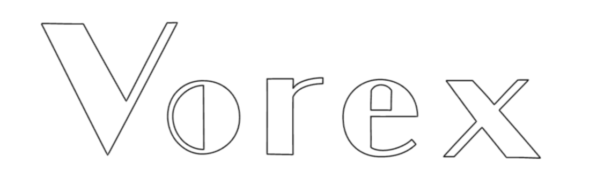

# Vortex Engine



The logo above is painted by this renderer : )

a mini render engine used for studying and testing

## Support

windows10 x64

## Gallery


## Framework Abstract

see Wiki

https://github.com/olleh-dlrow/Vortex/wiki


## Plan

- write perspective and orthographic camera √
- import libigl, load models √
- modify GUI，move viewport into ImguiWindow with frame buffer √
- finish dynamic batch render of opengl √
- create entity √
- import imguizmo 
- interaction in viewport √
  - get world pos of cursor in viewport window √
  - select point √
  - drag point √
- achieve shadow √
- achieve Bling-Phong √
- achieve IBL √
- achieve MSAA √
- achieve gamma correction √
- manage textures and materials √
- build forward rendering pipeline
- build delay rendering pipeline
- achieve SSAO

## Note

use shared_ptr or unique_ptr to manage heap space

design first, code second

achieve first, others second


## Usage

```shell
git clone <repo> --recursive
.\GenerateProjects.bat
```


**delete submodule:**

```shell
cd Vortex/vendor/moduleA

git rm moduleA

vim .git/config, delete [submodule moduleA]...

rm .git/modules/Vortex/vendor/moduleA
```


**add submodule:**

```shell
git submodule add url
```
