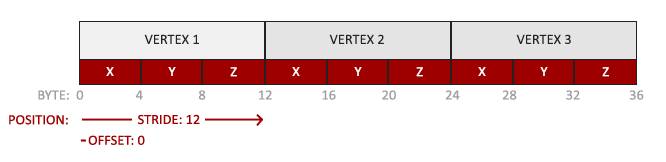

# Vortex Engine

a 2D game engine program

## Support

windows10 x64

## Third Party

[spdlog](https://github.com/gabime/spdlog.git)

[glfw](https://github.com/glfw/glfw.git)

[imgui](https://github.com/ocornut/imgui.git)

[glm](https://github.com/g-truc/glm.git)

[Home | Premake](https://premake.github.io/docs/)

## Usage

git clone \<repo\> --recursive

**delete submodule:**

cd Vortex/vendor/moduleA

git rm moduleA

vim .git/config, delete [submodule moduleA]...

rm .git/modules/Vortex/vendor/moduleA

**add submodule:**

git submodule add url

premake:

find compiled files in cmake

## Vortex

main:

Initialize log

create application

loop application

delete application

### Log

#### CoreLogger

static member

shared_ptr

use in vortex

#### ClientLogger

static member

shared_ptr

use in sandbox

#### Init

set:

log name

log level: output all

output location: stdout and file

### Application

behaviour:

initialize app

- create window
- init render
- push imgui layer

add layers

OnEvent:

>         // CORE part to event handling
>         // process:
>         // e -> captured by glfw 
>         // -> trigger window::eventCallBack(App::OnEvent)
>         // -> Application::OnEvent(e) -> end
>         // 
>         // handle event:
>         // e -> dispatch<some event>(handler) -> dispatch... -> ...
>         // e -> layer1(OnEvent) -> layer2(OnEvent) -> ...
>
>          
>
>         problem:
>
>         Event processing (`glfwPollEvents`) stalls whenever the window is resized, 
>
>         see annotation of glfw3.h:glfwPollEvents()

- handle all layers' events
- handle window events

main loop

static member:

s_Instance

member:

m_Window: Window

m_ImGuiLayer: ImGuiLayer

m_LastFrameTime: (maybe should put in another place)

state:

m_Running

m_Minimized

#### SandboxApp: Application

behaviour:

add user's layer

create application

### Window

virtual base class

behaviour:

set title, width, height

set sync

create main window

#### WindowsWindow: Window

behaviour:

init window's properties:

- response to window resize

- response to window close
- response to key press, release, repeat
- response to unicode char input
- response to mouse press, release
- response to scroll
- response to mouse move
- 

update window to flush graphics context

member:

GLFWWindow

GraphicsContext

WindowData:

- width, height
- title
- event callback, which response to glfw events

dependency:

glfw

### GraphicsContext

context of renderer

behaviour:

create graphics context

initialize context

swap buffers

#### OpenGLContext: GraphicsContext

context of opengl

behaviour:

initialize glfw context to OpenGLWindow and check opengl version

glfw swap buffers

### Event

the base of all kinds of events

member:

Handled bool

event type

> None = 0,
> WindowClose, WindowResize, WindowFocus, WindowLostFocus, WindowMoved,
> AppTick, AppUpdate, AppRender,
> KeyPressed, KeyReleased, KeyTyped,
> MouseButtonPressed, MouseButtonReleased, MouseMoved, MouseScrolled...

event name

event categories

> None = 0,
> EventCategoryApplication    = BIT(0),
> EventCategoryInput          = BIT(1),
> EventCategoryKeyboard       = BIT(2),
> EventCategoryMouse          = BIT(3),
> EventCategoryMouseButton    = BIT(4)

category:

application event:

- WindowResizeEvent
- WindowCloseEvent
- AppTickEvent
- AppUpdateEvent
- AppRenderEvent

input event:

key event:

- KeyEvent
- KeyPressedEvent
- KeyReleasedEvent
- KeyTypedEvent

mouse event:

- MouseMovedEvent
- MouseScrolledEvent
- MouseButtonEvent
- MouseButtonPressedEvent
- MouseButtonReleasedEvent

### EventDispatcher

dispatch current event to some handle

BROADCAST event to different classes

### Input

get input response like key, mouse etc.

behaviour:

get mouse position

check key pressed

check mouse button clicked

#### WindowsInput: Input

package glfw input event

### Layer

behaviour:

handle attach

handle detach

handle update

render gui

handle event

#### ImGuiLayer: Layer

initialize imgui context

config imgui

### LayerStack

store layers

LayerStack has two parts: Overlay on the top and Layer underneath it,
all of the layers in Overlay part are higher than layers in Layer part

behaviour:

push/pop layer

push/pop overlay

### Timestep

calculate time

### BufferElement

the element of buffer

member:

name

type of this element

size of this element

offset in buffer, calculated in buffer layout

### BufferLayout

define the layout of buffer with the information of buffer elements, 

calculate every element's offset in one buffer unit and stride

member:

buffer elements

stride

### VertexBuffer

the buffer of vertices, which may include coordinates, colors, normals, etc.

behaviour:

create vertex buffer

set data to buffer

bind this vertex buffer to activate it

unbind this vertex buffer

get/set layout of vertices

#### OpenGLVertexBuffer: VertexBuffer

implementation  to vertexbuffer with opengl

member:

id

layout

### IndexBuffer

explain vertex coordinates as triangles

behaviour:

create index buffer

bind this index buffer to activate it

unbind this index buffer

get count of indices

#### OpenGLIndexBuffer: IndexBuffer

implementation  to indexbuffer with opengl

member:

id

count of indices

### VertexArray

record attributes of vertex

behaviour:

create vertex array

bind this vertex array to activate it

unbind this vertex array

add vertex buffer

set index buffer

#### OpenGLVertexArray: VertexArray

member:

id

vertex buffer index

vertex buffers

index buffer

implementation  of add vertex buffer:

- activate this vertex array and vertex buffer
- enable vertex attribute array in current vertex buffer index
- set attribute pointer using layout of this vertex buffer
- update vertex buffer index

### Texture

behaviour:

get width, height

set data

bind this texture to activate it

check equal

#### Texture2D: Texture

2d of texture

behaviour:

create texture

##### OpenGLTexture2D: Texture2D

create texture

load texture in file

bind this texture to activate it

set storage format

set blend mode

set filter mode

set minmap

### Shader

shade objects with some methods

behaviour:

create using glsl

bind

unbind

set global value in glsl

#### OpenGLShader: Shader

implementation of shader

member:

id

name

behaviour:

compile vertex shader and fragment shader

pre process the source code of openGL shader: 

- source can include multiple shader types with flag "#type xxx" in start

### ShaderLibrary

store, add, load shaders

behaviour:

add shader

load shader with file

check if some shader exists

### RendererAPI

application interface gived by certain renderer, this determines which type of instance you will get through Create function in renderer

behaviour:

init renderer

set viewport

set clear color

clear screen

draw indexed objects

#### OpenGLRendererAPI: RendererAPI

implementation of RendererAPI

### RenderCommand

the common command used for renderer

behaviour:

invoke renderer api's function

### Renderer

render image to screen

member:

scene data:

- VPmatrix

behaviour:
init

shutdown

begin a scene with a camera

submit vertices and shaders to render

get renderer api

### Renderer2D

render 2d objects, statistic its consumption

behaviour:

init

shutdown

begin a scene with a camera

flush 

draw primitives

### OrthographicCamera

set and calculate m, v, p matrix

member:

projection matrix

view matrix

### OrthographicCameraController

control orthographic camera's behaviours

behaviour:

update

handle events:

- mouse scoll
- window resize
- others

